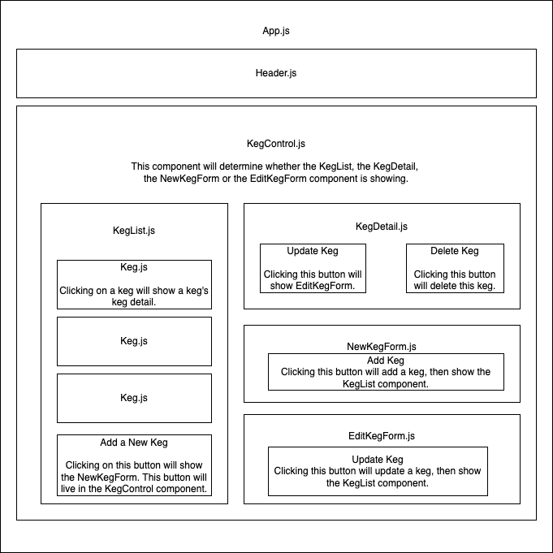

# _Tap Room_

#### By _**Curtis Brooks**_

#### _A practice application for using React to show an online tap room with full CRUD functionality for kegs._

## Technologies Used

* _HTML_
* _CSS_
* _JavaScript / JSX_
* _Bootstrap_
* _React_
* _NPM_

## Component Diagram

## Description

_Practice project for using React and functional programming. Full CRUD functionality for adding, editing, and removing kegs._

## Setup/Installation Requirements

* _Run `git clone https://github.com/curtisbrooks678/Tap-Room.Solution` from the terminal to clone the project directory to your device._
* _cd into the project directory, then cd into the tap-room directory, then run `npm install` to set up the environment and install all the npm packages._
* _Run `npm start` from the terminal to build the project and start a live server._
* _Navigate to `localhost:3000` in your favorite web browser to enjoy the project._

## Known Bugs

* _When a pint is sold, that keg moves to the bottom of the KegList._

## License - [MIT](https://opensource.org/licenses/MIT)

_If you run into any problems/bugs feel free to send me an email [(curtisbrooks678@gmail.com)](mailto:curtisbrooks678@gmail.com) with details._

Curtis Brooks 

Copyright (c) _2022_ _Curtis Brooks_
